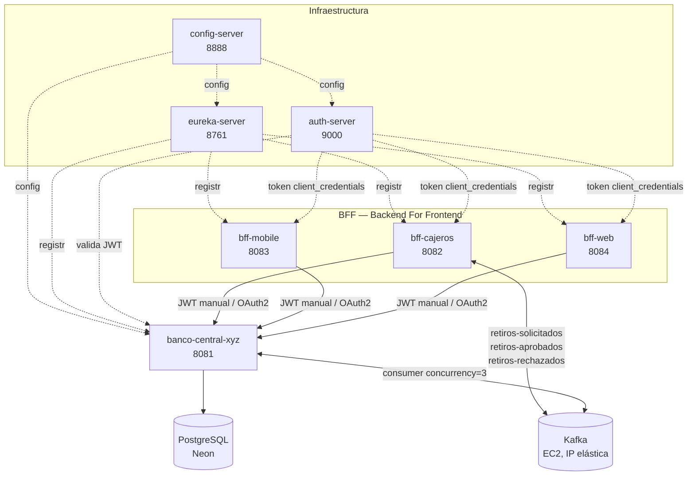

# Sistema Bancario XYZ — Microservicios, Resiliencia y Seguridad en la Nube

## Objetivo

Preparar el sistema de microservicios de Banco XYZ (Backend Central + 3 BFF + infraestructura de soporte) para un entorno Cloud resiliente y seguro: reforzar OAuth2.0 como mecanismo de autenticación servicio-a-servicio en los 3 BFF, extender Resilience4j al canal que aún no lo tenía, y dockerizar la totalidad de los microservicios con un único `docker-compose.yaml` que los orquesta.

## Arquitectura general



Los 7 microservicios corren en contenedores Docker, en una red local (`banco-net`). Kafka permanece fuera, en una instancia EC2 con IP elástica, conectado por red pública — no se dockerizó junto al resto por tratarse de infraestructura ya desplegada y estable desde la Semana 7.

## 1. OAuth2.0 — flujo funcional

Dos mecanismos de autenticación conviven en `banco-central-xyz`, cada uno resolviendo una pregunta distinta:

| Mecanismo | Pregunta que responde | Quién lo usa |
|---|---|---|
| JWT manual (`jjwt`) | "¿Qué usuario eres?" | Cliente final, vía login (`POST /api/auth/login`) |
| OAuth2 Resource Server | "¿Eres un servicio autorizado, con qué scope?" | Los 3 BFF, actuando como clientes de servicio |

**`auth-server`** es un Spring Authorization Server puro (sin código propio) que implementa `client_credentials`: un cliente registrado (`ms-seguridad-client`/`secret123`) obtiene un JWT con scope `cuentas.read`, sin que exista un usuario humano en la transacción.

**`banco-central-xyz`** mantiene dos `SecurityFilterChain` con `@Order` distinto: la cadena OAuth2 (`@Order(1)`, rutas `/api/oauth2/**`) exige `hasAuthority("SCOPE_cuentas.read")`; la cadena original (`@Order(2)`) sigue protegiendo el resto con JWT manual. `JwtAuthFilter` excluye explícitamente las rutas `/api/oauth2/**` para no interceptar tokens que no sabe interpretar.

Cada uno de los 3 BFF implementa su propio **cliente OAuth2** (`OAuth2TokenClient` + `CuentaBancariaOAuth2Client`): antes de llamar al endpoint real, obtiene su propio token automáticamente — sin que el usuario final tenga que proveer ningún token para esa llamada específica.

```
POST /oauth2/token  → auth-server (Basic Auth: client-id/client-secret)
GET  /bff-{canal}/cuentas/{id}/saldo-oauth2  → BFF obtiene su token y lo usa internamente
```

## 2. Tolerancia a fallos (Resilience4j)

Extendido a los 3 BFF (antes solo Cajeros): Circuit Breaker + Retry + Rate Limiter, mismo patrón y configuración en los tres, aplicado sobre el `Client` principal de cada uno.

| Patrón | Configuración |
|---|---|
| Retry | 3 intentos, backoff exponencial (1s, 2s) |
| Circuit Breaker | Ventana de 10 llamadas, mínimo 5 para evaluar, abre con ≥50% de fallas o llamadas lentas (>2s) |
| Rate Limiter | 5 llamadas cada 10s |

`ResilienceEventLogger` se suscribe a los eventos internos (`onStateTransition`, `onRetry`) en los 3 BFF, dejando evidencia explícita en consola de cada transición `CLOSED → OPEN → HALF_OPEN → CLOSED`.

## 3. Mensajería asíncrona (Kafka) — heredado de la Semana 7, con mejora de inicialización

`bff-cajeros` publica `RetiroSolicitadoEvent` de forma asíncrona; `banco-central-xyz` lo consume (concurrency=3, 3 particiones), procesa el retiro y publica el resultado. Ver `README_Semana7.md` para el detalle completo del flujo y el diagrama de eventos.

**Mejora agregada esta semana**: se incorporó un servicio `kafka-init` al `docker-compose.yml` del clúster Kafka (EC2), que crea automáticamente los 3 tópicos de negocio (`retiros-solicitados`, `retiros-aprobados`, `retiros-rechazados`) apenas los 3 brokers reportan `healthy` (`depends_on: condition: service_healthy`). Antes, los tópicos debían crearse manualmente con `kafka-topics --create` cada vez que el clúster se levantaba desde cero — ahora el propio `docker-compose up -d` los deja listos sin intervención manual, lo cual resultó especialmente útil tras un reinicio no planificado de la instancia EC2 que forzó una reconstrucción completa del clúster (incluyendo la limpieza de un estado corrupto de Zookeeper, `NodeExistsException`, mediante `docker-compose down -v`).

**Prueba end-to-end validada con los microservicios ya dockerizados**:
```bash
curl.exe -X POST http://localhost:8082/bff-cajero/cuentas/8/retiros -H "Content-Type: application/json" -d "{\"monto\": 100.00}"
# → 202 Accepted, { "solicitudId": "...", "estado": "PENDIENTE" }

curl.exe http://localhost:8082/bff-cajero/cuentas/retiros/<solicitudId>
# → { "estado": "APROBADO", "saldoInicial": 9900.00, "saldoFinal": 9800.00, "motivo": "Retiro procesado correctamente" }
```
Confirma que el flujo completo funciona de punta a punta con `bff-cajeros` y `banco-central-xyz` corriendo en contenedores locales, comunicándose con el clúster Kafka en EC2 a través de la IP elástica.

## 4. Dockerización

### Dockerfile (multi-stage, mismo patrón en los 7 microservicios)

```dockerfile
FROM maven:3.9-eclipse-temurin-<version> AS build
WORKDIR /app
COPY pom.xml .
RUN mvn dependency:go-offline -B
COPY src ./src
RUN mvn clean package -DskipTests

FROM eclipse-temurin:<version>-jre-jammy
WORKDIR /app
COPY --from=build /app/target/*.jar app.jar
EXPOSE <puerto>
ENTRYPOINT ["java", "-jar", "app.jar"]
```

`auth-server` usa Java 21 (hereda el `pom.xml` de referencia de la Semana 6); el resto usa Java 17. Se usa la variante `jammy` (Ubuntu) en lugar de `alpine`: la imagen Alpine (`musl libc`) provocó crashes `SIGSEGV` intermitentes de la JVM bajo WSL2.

### docker-compose.yaml

Un único archivo orquesta los 7 servicios en la red `banco-net`. Puntos clave:

- **`config-repo` se monta como volumen** (`./config-repo:/config-repo`) en `config-server`, en lugar de empaquetarse dentro de una imagen — permite editar la configuración centralizada sin reconstruir la imagen.
- **Healthcheck + `condition: service_healthy`** en `config-server`: `banco-central-xyz` espera activamente a que `config-server` responda en `/actuator/health` antes de arrancar, evitando una condición de carrera donde intentaba obtener su configuración antes de que el servidor estuviera listo.
- **URLs internas por nombre de contenedor**: dentro de la red Docker, los servicios se referencian entre sí por nombre (`http://config-server:8888`, `http://eureka-server:8761`, `http://banco-central-xyz:8081`, `http://auth-server:9000`), no por `localhost`.
- **Kafka permanece externo**: `spring.kafka.bootstrap-servers` sigue apuntando a la IP elástica de la instancia EC2, sin cambios respecto a la Semana 7.

### Problemas resueltos durante la dockerización

| Problema | Causa | Solución |
|---|---|---|
| `Connection refused` a `config-server` | `depends_on` simple solo espera a que el contenedor exista, no a que la app esté lista | Healthcheck + `condition: service_healthy` |
| `password authentication failed` | Contraseña de Neon desactualizada en `.env` | Actualizar `.env` con la contraseña vigente |
| `SIGSEGV` en runtime | Imagen base `alpine` incompatible bajo WSL2 | Cambiar a `eclipse-temurin:*-jre-jammy` en los 7 Dockerfile |
| `UnsupportedClassVersionError` en `auth-server` | Ambas etapas del Dockerfile quedaron en Java 17 tras el cambio de imagen base, pero el proyecto compila con Java 21 | Corregir ambas etapas a `eclipse-temurin-21` |
| `cannot find symbol: class Test` al compilar `auth-server` | El archivo de test por defecto quedó sin la dependencia `spring-boot-starter-test` (removida intencionalmente en la Semana 6) | Restaurar la dependencia de test |
| `KeeperException$NodeExistsException` al arrancar los brokers de Kafka (EC2) | Tras un reinicio no limpio de la instancia EC2, Zookeeper conservó el registro efímero de un broker de una sesión anterior, y el nuevo intento de registro con el mismo ID chocó contra ese estado persistido | `docker-compose down -v` (elimina volúmenes, clúster recreado desde cero) |

## Instrucciones de ejecución

**1.** Infraestructura Kafka en EC2 — ya debe estar corriendo (ver `README_Semana7.md`).

**2.** Variables de entorno — crear `.env` en la raíz de `Docker S8/`:
```
DB_PASSWORD=<contraseña vigente de Neon>
JWT_SECRET=estaclaveesmuylarga1234567890000
```

**3.** Levantar el stack completo:
```bash
docker compose up -d --build
```

**4.** Verificar que los 7 contenedores estén `Up` (y `config-server` `healthy`):
```bash
docker ps
```

**5.** Verificar registro en Eureka: `http://localhost:8761` → deben aparecer `BANCO-CENTRAL-XYZ`, `BFF-CAJEROS`, `BFF-MOBILE`, `BFF-WEB`.

## Prueba end-to-end (OAuth2, dockerizado)

```bash
curl.exe -X POST http://localhost:9000/oauth2/token -u ms-seguridad-client:secret123 -d "grant_type=client_credentials&scope=cuentas.read"

curl.exe -X GET http://localhost:8081/api/oauth2/cuentas/8/saldo -H "Authorization: Bearer <token>"
```

Respuesta esperada: `{"saldo": 9900.00}` (dato real, leído desde Neon a través del contenedor).

## Estructura del repositorio

```
Docker S8/
├── docker-compose.yaml
├── .env                       (no versionado — contiene secretos)
├── .gitignore
├── config-server/
├── eureka-server/
├── auth-server/
├── banco-central-xyz/
├── bff-cajeros/
├── bff-mobile/
├── bff-web/
└── config-repo/
```

Cada microservicio incluye su propio `README.md` individual con su rol específico, puerto, configuración relevante y endpoints principales.

## Limitaciones conocidas

- El registro en Eureka sigue siendo demostrativo: ningún servicio consulta a Eureka para resolver direcciones de otro; todas las llamadas internas usan nombres de contenedor fijos definidos en `docker-compose.yaml`.
- Kafka no está dockerizado junto al resto de los microservicios; permanece en su propia instancia EC2, conectado por red pública.
